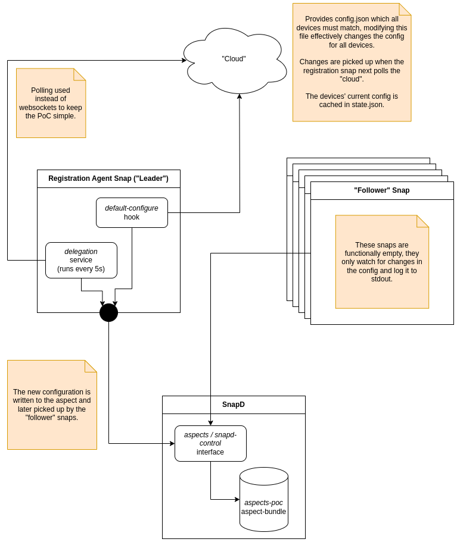

# Aspects PoC

A proof of concept for snap configuration sharing across snaps using snapd's aspects.



## Installation

To install this PoC, simply run the installation script:

```console
$ /bin/bash -c "$(curl -fsSL https://raw.githubusercontent.com/st3v3nmw/aspects-poc/main/install.sh)"
Acknowledging account/f22PSauKuNkwQTM9Wz67ZCjNACuSjjhN assertion...
Acknowledging account-key/xkd_Y2ay5N2Uo14v_wsCtfVJYLAVbJgxbiKM8Ne4mZBflaROriZgk2nb5i9Oebum assertion...
Acknowledging aspect-bundle/aspects-poc assertion...
Installing aspects-server...
aspects-server (edge) 0.1 from Stephen Mwangi (st3v3nmw) installed
Installing aspects-registration-agent...
aspects-registration-agent (edge) 0.1 from Stephen Mwangi (st3v3nmw) installed
Installing aspects-follower...
aspects-follower (edge) 0.1 from Stephen Mwangi (st3v3nmw) installed
```

## Running the demo

Make sure that you've installed the PoC using the installation script above. The script should install the server, a registration agent, and 4 followers in that order.

Everything should run automatically and within a minute or so, the `registration-agent` should contact the server for registration. Once registered, its config should look like this:

```console
$ snap get aspects-registration-agent -d
{
    "is-registered": true,
    "server-url": "http://localhost:8000"
}
```

The `device` aspect should also be updated with the new device state after registration:

```console
$ snap get f22PSauKuNkwQTM9Wz67ZCjNACuSjjhN/aspects-poc/device -d
{
    "architecture": "i386",
    "ip-address": "192.168.0.103",
    "public-rsa-key": "ssh-rsa AAAAB3NzaC1yc2EAAAADAQABAAABAQC2h5I+m49l7JWcWaaLNYwkAS9XifSRgt2YDd6rjI0I0xRy0nHfaUnEsgybyD+HWhQ7NUOBBWJYxvauZqgo0cBdEGWa8B7nS7GOwSixkzkk74GNdazgMhkvYNDLsrf/pKld1YfBJMYSg0gPM/0M39DUO48Hipk4NzFHsWL3txi3li1t87KlFZz6qrY0wg5j8rXPIF3mRluwJWKqMGUDBDSAj1gx4p/rsNFwvaLrakJZSant4ynCca+sGn41XMjZci/MVD7HhSM9TDK+SBn6VTfN0EsxQMLljNApYNxpjvG0vKgT/Hq+LU9ochD8yAn+vJmtO9sXHawM0frl536cre8N",
    "registered": 1711097291,
    "uid": "47c932e1-f450-4a80-88be-58eef4f7800e"
}
```

At this point, the `snap-config` aspect should be empty:

```console
$ snap get f22PSauKuNkwQTM9Wz67ZCjNACuSjjhN/aspects-poc/snap-config -d
error: cannot get "" in aspect f22PSauKuNkwQTM9Wz67ZCjNACuSjjhN/aspects-poc/snap-config: matching
       rules don't map to any values
```

After another minute or so, the `registration-agent` will poll the server to get the target config and the `snap-config` aspect is updated accordingly:

```console
$ snap get f22PSauKuNkwQTM9Wz67ZCjNACuSjjhN/aspects-poc/snap-config -d
{
        "follower-1": {
                "domain": "example.com",
                "gzip": true,
                "port": 3000,
                "protocol": "https"
        },
        "follower-2": {
                "dsn": "postgresql://example.com:5432",
                "flags": {
                        "autocommit": true,
                        "transaction_isolation": "REPEATABLE-READ"
                }
        },
        "follower-3": {
                "logs": [
                        "/var/lib/landscape-client/broker.log",
                        "/var/lib/landscape-client/monitor.log",
                        "/var/lib/landscape-client/manager.log"
                ]
        },
        "follower-4": {
                "telemetry": true
        }
}
```

Next, we'll update the config on the server by running the following `curl` command. Please note that `PUT` to `/target-config/` will replace the entire config.

```console
$ curl -X PUT -H "Content-Type: application/json" -d '{"config": {"follower-1": {"domain": "staging.example.com"}, "follower-4": {"telemetry": false}}}' http://localhost:8000/target-config/
{"config":{"follower-1":{"domain":"staging.example.com"},"follower-4":{"telemetry":false}}}%

$ curl -s http://localhost:8000/target-config/ | jq
{
  "config": {
    "follower-1": {
      "domain": "staging.example.com"
    },
    "follower-4": {
      "telemetry": false
    }
  }
}
```

After some time, the `registration-agent` will poll the server once again and the config will be updated:

```console
$ snap get f22PSauKuNkwQTM9Wz67ZCjNACuSjjhN/aspects-poc/snap-config -d
{
        "follower-1": {
                "domain": "staging.example.com"
        },
        "follower-4": {
                "telemetry": false
        }
}
```

## Server API documentation

While the server is running (corresponding snap has been installed), documentation is available at [127.0.0.1:8000/docs](127.0.0.1:8000/docs).

## Development

Make sure you've installed the PoC using the installation script above to make sure that all assertions are acknowledged and experimental features like aspects are turned on.

### Building the snaps

Run `make` or `make all` to build all snaps at once or run the following commands to build them individually:

```console
$ make follower
Building follower snap...
Generated snap metadata
Created snap package aspects-follower_0.1_amd64.snap

$ make registration-agent
Building registration-agent snap...
Generated snap metadata
Created snap package aspects-registration-agent_0.1_amd64.snap

$ make server
Building server snap...
Generated snap metadata
Created snap package aspects-server_0.1_amd64.snap
```

### Installing the snaps

To use the make targets below, make sure you have [yq](https://github.com/mikefarah/yq) installed. You can install it using [Homebrew](https://brew.sh/) or as a snap:

```console
$ brew install yq
$ snap install yq
```

Run `make install-all` to install all the snaps at once or run the following commands to install them individually:

```console
$ make install-follower
Installing follower snap...
aspects-follower 0.1 installed

$ make install-registration-agent
Installing registration-agent snap...
aspects-registration-agent 0.1 installed

$ make install-server
Installing server snap...
aspects-server 0.1 installed
```

### Debugging

You can check the snap logs for each component:

```console
$ snap logs aspects-server -n 10
2024-03-22T12:28:09+03:00 aspects-server.daemon[382257]: INFO:     127.0.0.1:37268 - "POST /poll/ HTTP/1.1" 200 OK
2024-03-22T12:29:06+03:00 aspects-server.daemon[382257]: INFO:     127.0.0.1:49496 - "POST /poll/ HTTP/1.1" 200 OK
2024-03-22T12:30:15+03:00 aspects-server.daemon[382257]: INFO:     127.0.0.1:51122 - "POST /poll/ HTTP/1.1" 200 OK
2024-03-22T12:31:10+03:00 aspects-server.daemon[382257]: INFO:     127.0.0.1:47016 - "POST /poll/ HTTP/1.1" 200 OK
2024-03-22T12:32:04+03:00 aspects-server.daemon[382257]: INFO:     127.0.0.1:37130 - "POST /poll/ HTTP/1.1" 200 OK
2024-03-22T12:33:17+03:00 aspects-server.daemon[382257]: INFO:     127.0.0.1:41292 - "POST /poll/ HTTP/1.1" 200 OK
2024-03-22T12:34:07+03:00 aspects-server.daemon[382257]: INFO:     127.0.0.1:47960 - "POST /poll/ HTTP/1.1" 200 OK
2024-03-22T12:35:09+03:00 aspects-server.daemon[382257]: INFO:     127.0.0.1:44808 - "POST /poll/ HTTP/1.1" 200 OK
2024-03-22T12:36:06+03:00 aspects-server.daemon[382257]: INFO:     127.0.0.1:46410 - "POST /poll/ HTTP/1.1" 200 OK
2024-03-22T12:37:12+03:00 aspects-server.daemon[382257]: INFO:     127.0.0.1:40530 - "POST /poll/ HTTP/1.1" 200 OK

$ snap logs aspects-registration-agent -n 10
2024-03-22T12:35:08+03:00 systemd[1]: Starting Service for snap application aspects-registration-agent.daemon...
2024-03-22T12:35:09+03:00 systemd[1]: snap.aspects-registration-agent.daemon.service: Deactivated successfully.
2024-03-22T12:35:09+03:00 systemd[1]: Finished Service for snap application aspects-registration-agent.daemon.
2024-03-22T12:36:05+03:00 systemd[1]: Starting Service for snap application aspects-registration-agent.daemon...
2024-03-22T12:36:06+03:00 systemd[1]: snap.aspects-registration-agent.daemon.service: Deactivated successfully.
2024-03-22T12:36:06+03:00 systemd[1]: Finished Service for snap application aspects-registration-agent.daemon.
2024-03-22T12:37:10+03:00 systemd[1]: Starting Service for snap application aspects-registration-agent.daemon...
2024-03-22T12:37:12+03:00 systemd[1]: snap.aspects-registration-agent.daemon.service: Deactivated successfully.
2024-03-22T12:37:12+03:00 systemd[1]: Finished Service for snap application aspects-registration-agent.daemon.
2024-03-22T12:37:12+03:00 systemd[1]: snap.aspects-registration-agent.daemon.service: Consumed 1.593s CPU time.
```
